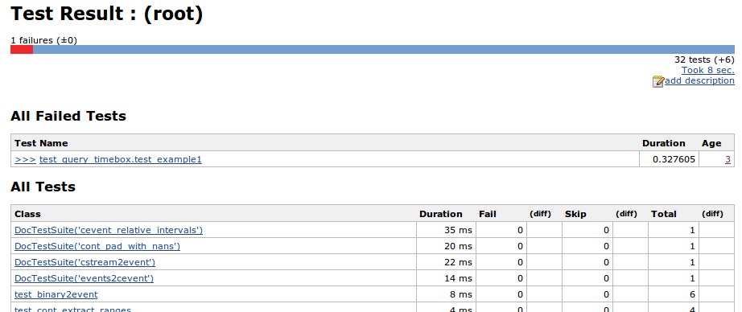
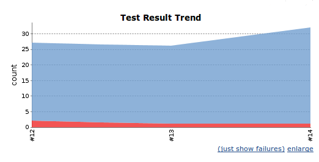

# matlab-xunit

xUnit for Matlab with JUnit-compatible XML output

# README

Testing is wonderful! Let's make it easier and more rewarding!

The most popular testing platform for MATLAB functions and classes is/was Steve Eddins' excellent [Matlab xUnit](http://www.mathworks.com/matlabcentral/fileexchange/22846-matlab-xunit-test-framework) package.

The previous maintainer, [Thomas Smith](https://github.com/tgs/), made two additions to that package: the ability to give output in a JUnit-compatible XML format, and the ability to run DocTests, similar to the ``doctest`` module in Python or vignettes in R.

I've made one additional change: renaming ``runtests`` to ``runxunit`` so that it's compatible with MATLAB R2013a and newer. (``runtests`` is now a built-in function.)

# XML Output

Why would you want to do that?  Well, because other tools understand it. In particular, I'm using the Jenkins continuous integration system (http://jenkins-ci.org/) to automatically run unit tests when I check in code. Jenkins understands JUnit's XML report format, and can display it in very nice ways. By creating a test report file in the same format, we can leverage all of that.

For example, here's a screenshot of the table Jenkins generates from a single build's report:

And here's a graph of the test trend:

## Usage

To use this feature, clone or download this from GitHub, and put the ``xunit-matlab/xunit`` directory on your MATLAB path (using ``addpath``).

Once you've written some unit tests (see [xUnit's help](https://cdn.rawgit.com/psexton/matlab-xunit/master/doc/xunit_product_page.html)), you can then run:

    runxunit path/to/test/dir -xmlfile testreport.xml

Unsurprisingly, this will run your unit tests and put the results into ``testreport.xml`` in the current directory.

